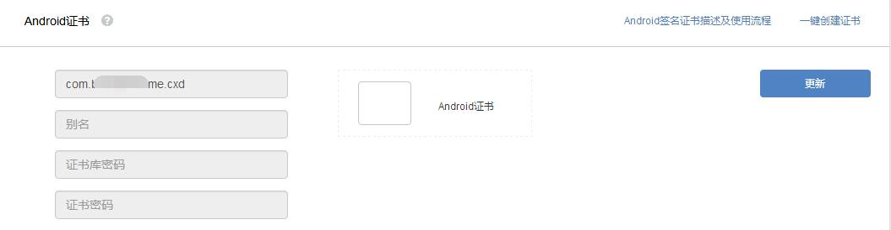
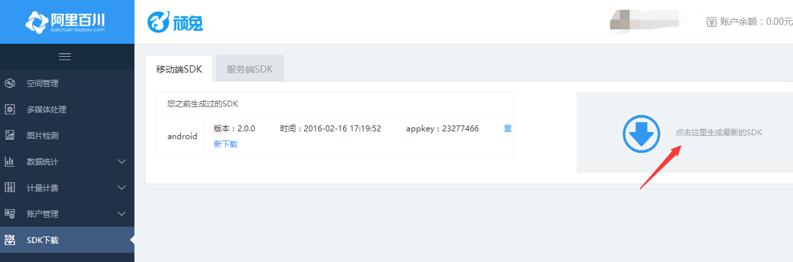
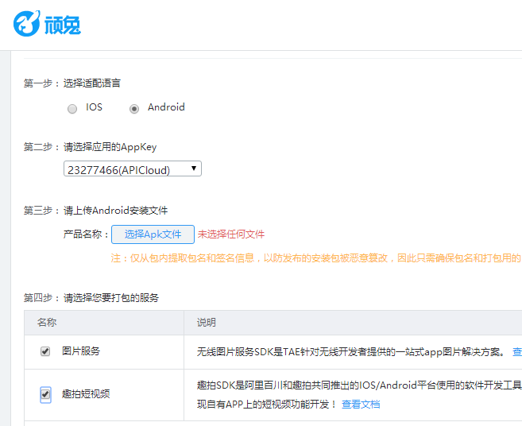
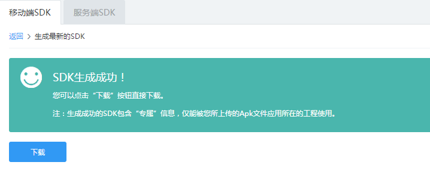
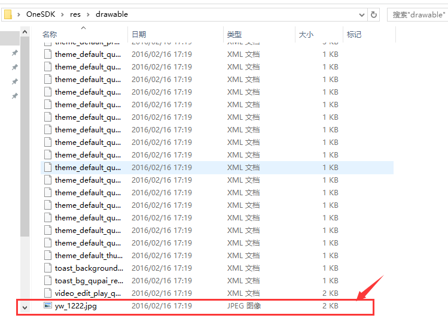
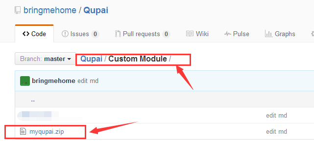

# 趣拍接入指南
APICloud平台使用趣拍的教程，包含入驻阿里百川，获取趣拍SDK

因为此模块需要用到以下三个东西：

1. 安全图片，从阿里百川的顽兔平台获取

2. 将安全图片放到依赖的自定义模块中，这个很重要，否则初始化都不能通过

3. 水印图片，放在自己工程的目录下，路径为 "assets://Qupai/watermark/logo.png", 代码中需要指定

>指南目录

* [获取安全图片](#获取安全图片)

* [绑定依赖的模块](#绑定依赖的模块)

* [水印图片](#水印图片)

##**概述**

首先需要确定，你现在是否已经生成了Android的证书，[前去查看](http://www.apicloud.com/certificate)，下图所示则说明没有生成证书

1. 如果没有，那么你可以直接下载自定义模块(myqupai.zip), 添加到自定义模块中，调用接口进行测试，打APK包的时候选择测试版

2. 如果已经生成了证书，那么请往下继续看

#**获取安全图片**

1. 首先，在APICloud平台生成apk文件，下载到本地

2. 完成阿里百川的接入指引，[传送门](http://baichuan.taobao.com/doc2/detail?spm=0.0.0.0.Ic4eyn&treeId=38&articleId=102761&docType=1)

3. 通过控制台进入 SDK 下载，生成最新SDK，[传送门](http://wantu.taobao.com/sdk/index.htm?spm=a312x.7754881.0.0.HYWRNF#/mobile)

4. 语言选择 Android，并APICloud平台生成apk文件 (APK 包的内容不做要求，可以不是最终的应用；但是私钥跟安全图片必须是一一对应的，如果私钥发生改变需重新生成安全图片) ，选择要打包的服务(图片和趣拍短视频都勾选)，点击 “生成最新的SDK”

5. 下载SDK

6. 解压，并获取安全图片 yw_1222.jpg

#**绑定依赖的模块**

1、下载自定义模块

2、此时再回来查看证书权限管理[http://my.open.taobao.com/](http://my.open.taobao.com/)，是不是已经有了，这个id在调用[showTaokeItemById接口](http://docs.apicloud.com/%E7%AB%AFAPI/%E5%BC%80%E6%94%BESDK/alibaichuan#6)的时候需要用到

#**水印图片**

1、点此加入淘宝联盟[http://pub.alimama.com/?spm=0.0.0.0.CrMksN](http://pub.alimama.com/?spm=0.0.0.0.CrMksN)

这个和开店一样，所以需要人工审核，审核时间也有点长，一般1-2个工作日
