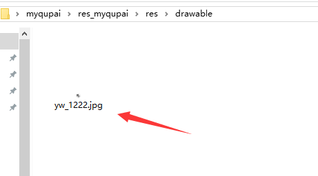

# 趣拍接入指南
APICloud平台使用趣拍的教程，包含入驻阿里百川，获取趣拍SDK

因为此模块需要用到以下三个东西：

1. 安全图片，从阿里百川的顽兔平台获取

2. 将安全图片放到依赖的自定义模块中，这个很重要，否则初始化都不能通过

3. 水印图片，放在自己工程的目录下，路径为 "assets://Qupai/watermark/logo.png", 代码中需要指定

>指南目录

* [获取安全图片](#获取安全图片)

* [绑定依赖的模块](#绑定依赖的模块)

* [水印图片](#水印图片)


##**概述**

首先需要确定，你现在是否已经生成了Android的证书，[前去查看](http://www.apicloud.com/certificate)，下图所示则说明没有生成证书


1. 如果没有，那么你可以直接下载自定义模块(myqupai.zip), 添加到自定义模块中，调用接口进行测试，打APK包的时候选择测试版

2. 如果已经生成了证书，那么请往下继续看


#**获取安全图片**<div id="获取安全图片"></div>

1、首先，在APICloud平台生成apk文件，下载到本地


2、完成阿里百川的接入指引，[传送门](http://baichuan.taobao.com/doc2/detail?spm=0.0.0.0.Ic4eyn&treeId=38&articleId=102761&docType=1)

3、通过控制台进入 SDK 下载，生成最新SDK，[传送门](http://wantu.taobao.com/sdk/index.htm?spm=a312x.7754881.0.0.HYWRNF#/mobile)


4、语言选择 Android，并APICloud平台生成apk文件 (APK 包的内容不做要求，可以不是最终的应用；但是私钥跟安全图片必须是一一对应的，如果私钥发生改变需重新生成安全图片) ，选择要打包的服务(图片和趣拍短视频都勾选)，点击 “生成最新的SDK”


5、下载SDK


6、解压，并获取安全图片 yw_1222.jpg


#**绑定依赖的模块**<div id="绑定依赖的模块"></div>

1、先下载趣拍的git压缩包，里面包含自定义模块(Qupai-master.zip\Qupai-master\Custom Module),


2、解压自定义模块，用上一节SDK中获取的安全图片，替换此模块中的安全图片



3、重新压缩自定义模块，直接在myqupai文件夹上点击压缩


4、上传自定义模块，


5、并勾选自定义模块，能在已添加模块中看到即可


#**水印图片**<div id="水印图片"></div>

1、将自己的logo图片放在工程的image目录下


2、调用接口时候指定路径，如下

##示例代码

```js
var qupai = api.require('qupai');

var param = {
	maxRecordTime:6,
	videoBitrate:1024*1000,
	waterMarkPath:"assets://widget/image/logo.png",
	waterMarkPostion:2,
};

qupai.startQuPai(param,function(ret, err){
	if(ret)
		alert(JSON.stringify(ret));
	else
		alert("err --> "+JSON.stringify(err));
});
```

如果还有问题，请联系(sin@feeling.life)

(完)